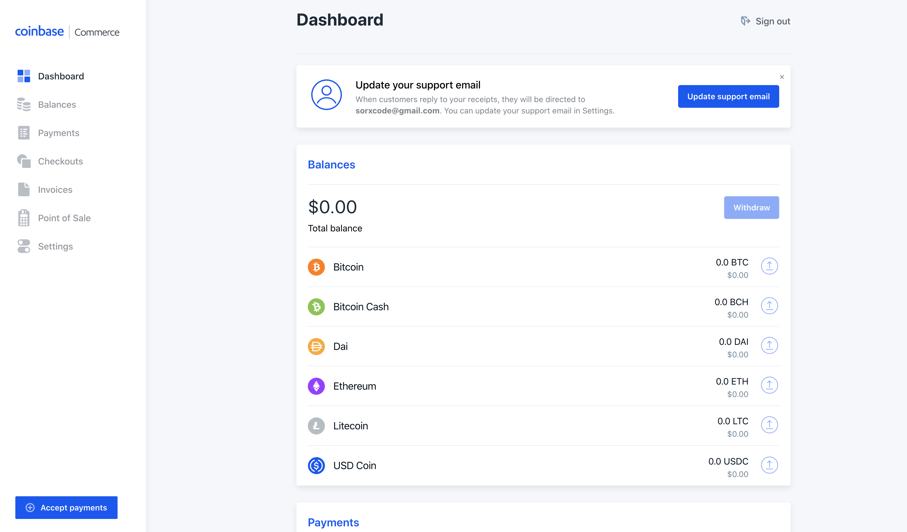
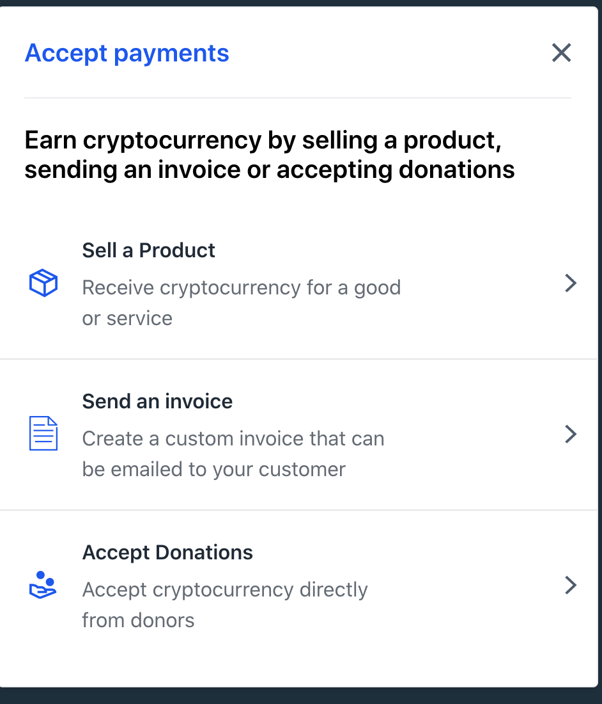
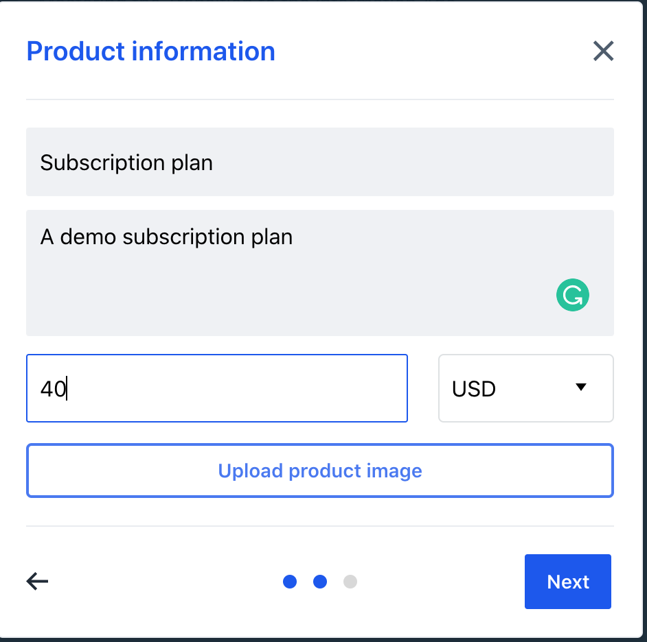
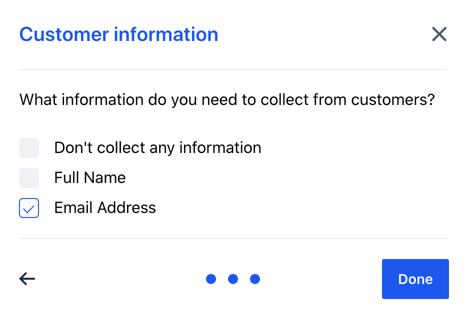
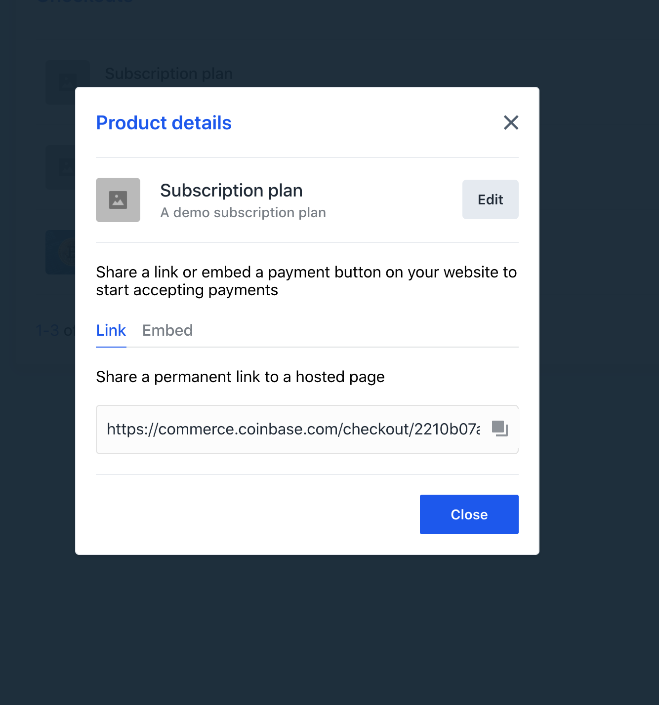
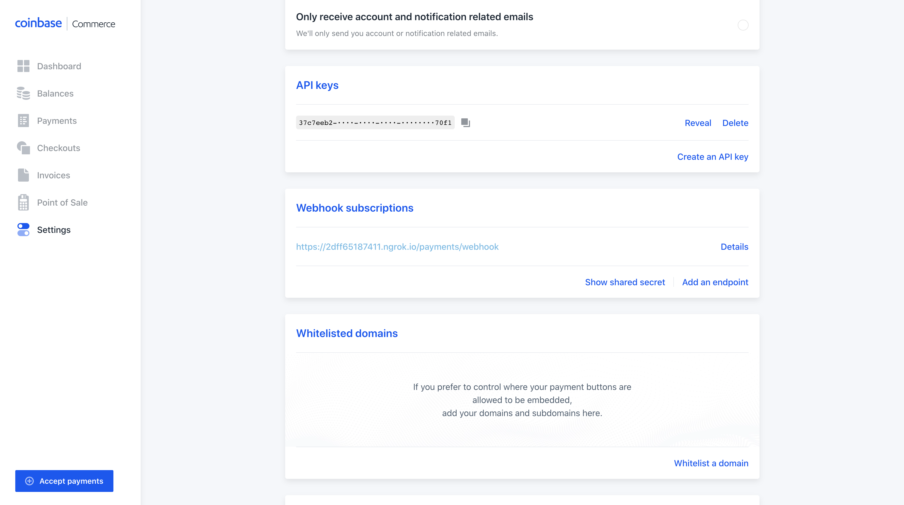
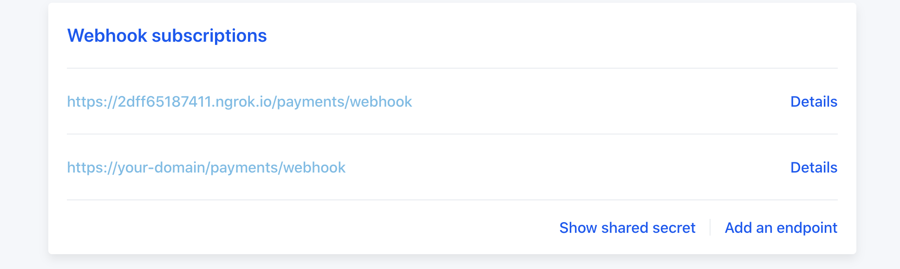
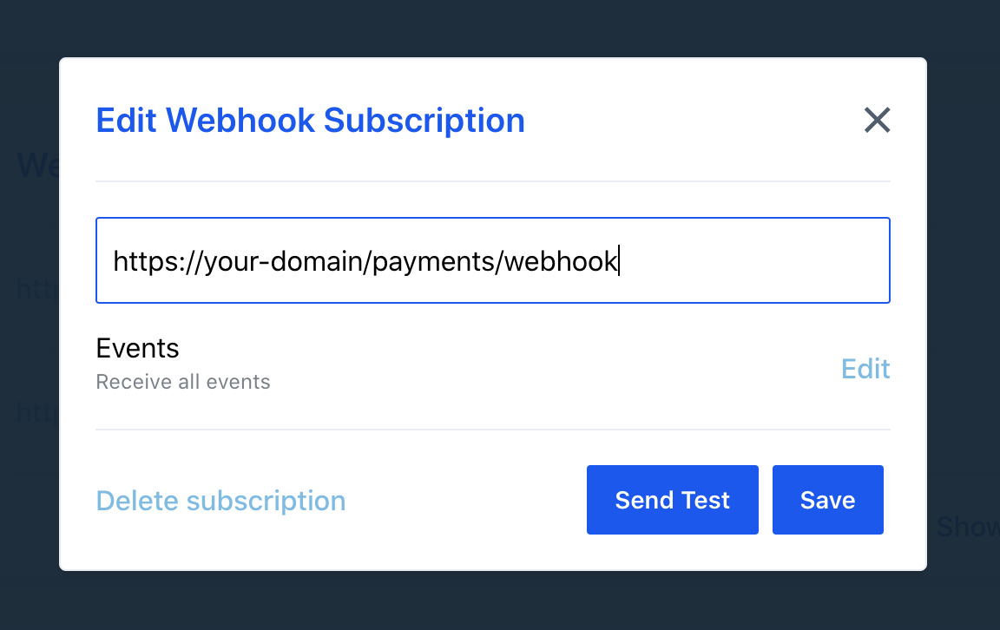
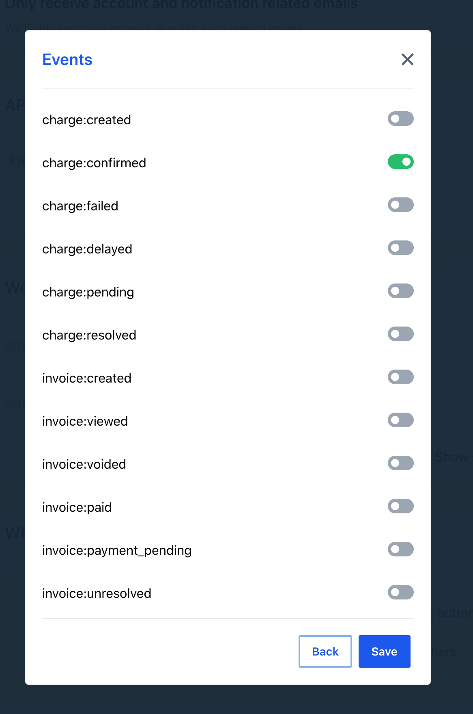

# CRYPTOME

## Features List

- Registeration
- Login
- Account confirmation by Email
- Single Session Per Account at Once
- Logout
- Profile
- User Invitation by Email
- Payment with Cryptocurrency [BTC, USDC, ETH, LTC, BCH, DAI]
- Subscription
- Referrer Reward
- Admin commands

## Create and Activate Virtual Environment

```shell
python3 -m venv venv
source venv/bin/activate
```

## Install dependencies

```shell
pip install -r requirements.txt
```

## Database Requirement

Sqlite3 database is used for this application. Database technology can be changed before actual deployment to any other SQL database e.g PostgreSQL

## Integrations

All configuration values needed to make the application work are saved in the `.env` file. External credentials are also saved in the `.env`.

Third Party integrations in this application are:

- [Coinbase Commerce](https://commerce.coinbase.com/): This is the cryptocurrency payment gateway. All purchases made by users on the application are processed securely by Coinbase Commerce. Guide on setting up an account, product, obtaining an API and checkout ID can be [found here](https://commerce.coinbase.com/docs/)

- [SENDGRID](https://app.sendgrid.com/): This is the mailing service provider used in this application. All forms of emailing to users are handled by SENDGRID. Guide on setting up an account, obtaining an API Key and getting sender/verifying a domain can be [found here](https://sendgrid.com/docs/)

## Perform databases migration

To run application for the first time, perform database migration (creating datatables and rules) using the commands below at the root folder

- This is needed for the first time you're running the application only.

```shell
flask db init
flask db migrate
flask db upgrade
```

## Run application

```shell
set FLASK_APP=app
flask run
```

Visit [http://localhost:5000](http://localhost:5000) in your browser to continue to the application.

## Admin commands

Admin can perform the following operation from the Command Line Interface.

- Add User: `flask admin adduser`
- Delete User: `flask admin deleteuser`
- Reward User: `flask admin rewarduser`
- Delete User Reward: `flask admin deletereward`

### Extra note

If having issues with the payment modal not showing, check that your browser url domain is [http://localhost:5000](http://localhost:5000) and not [http://127.0.0.1:5000](http://127.0.0.1:5000).

If domain is [http://127.0.0.1:5000](http://127.0.0.1:5000), log out before changing the domain in the browser, else you won't be able to login to a new session on [http://localhost:5000](http://localhost:5000)

### ---

To run application in specific port and IP

```shell
set FLASK_APP=app
flask run --host [ADDRESS or IP] --port [PORT]
```

## How to Setup Coinbase Account

- Register or signin an account on [Coinbase](https://commerce.coinbase.com/). This will take you to your dashboard. 

- Click on "Checkouts" in the side menu. This will take you to a page where you can manage your inventories or products. Create a new checkout item as a product and select collect customer information at the final step

<p align="center">





</p>

- Copy the checkout ID in resulting page. The final part of the address is the product's/subscription's checkout ID. This checkout ID will be used in this application.

<p align="center">



</p>

- For example:

    if address: [https://commerce.coinbase.com/checkout/2210b07a-6968-4202-941b-31bac11e6eb0](https://commerce.coinbase.com/checkout/2210b07a-6968-4202-941b-31bac11e6eb0)

    checkout ID is: 2210b07a-6968-4202-941b-31bac11e6eb0

- Goto [Coinbase Commerce Settings](https://commerce.coinbase.com/dashboard/settings) and scroll down to create an API KEY. Copy created API KEY.

<p align="center">



</p>

- Scroll down to Webhook Subscriptions on the settings page and add [https://your-domain/payments/webhook](https://your-domain/payments/webhook) as a webhook endpoint and save. This endpoint exist on the created application. Ensure your server have HTTPS for this application.

<p align="center">


</p>

- On the same page, click on `details` of the added endpoint and edit the endpoint's `Events`. Deselect all except charge:confirmed and save.

<p align="center">





</p>

### How To Configure Apllication To Use Created Coinbase Account Above

- Edit the `.env` file and replace the following fields

```shell
COINBASE_APIKEY="Created APIKEY from above"
COINBASE_CHECKOUT_ID="Created CheckoutID from above"
```
